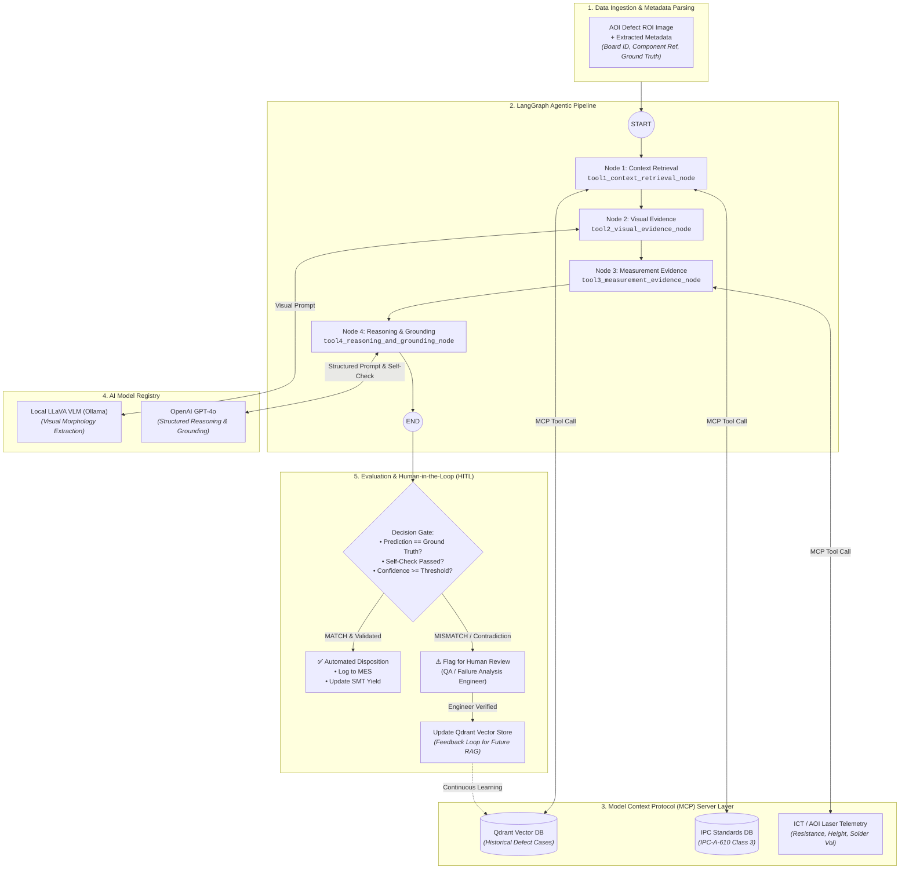

# 🔍 AI-Powered PCB Defect Inspection Agent

An industrial-grade, multi-agent inspection pipeline built on **LangGraph**, combining **Local Vision-Language Models (LLaVA)**, **OpenAI (GPT-4o)** reasoning, **Model Context Protocol (MCP)** standardized tool servers, and **Qdrant Vector RAG** for root-cause analysis and automated quality assurance on Surface Mount Technology (SMT) production lines.

---

## ✨ Key Features

* **LangGraph Orchestration:** Deterministic multi-node state graph coordinating context retrieval, visual inspection, physical telemetry grounding, and self-check verification.
* **Model Context Protocol (MCP):** Decoupled, standardized tool layer (`pcb_mcp_server.py`) serving Qdrant vector search, IPC standard lookup, and ICT measurement telemetry.
* **Hybrid AI Architecture:**
  * **Local LLaVA (via Ollama):** Inspects PCB component ROI images on-premise without exposing raw defect images.
  * **OpenAI (GPT-4o):** Performs structured cross-evidence reasoning, physical grounding, and strict JSON output generation.
* **Qdrant In-Memory Vector RAG:** Retrieves historically similar past defect precedents using cosine similarity to assist in root-cause diagnosis.
* **7-Class Defect Taxonomy:**
  1. `missing part`
  2. `shifted`
  3. `foreign material`
  4. `tombstone`
  5. `solder insufficient`
  6. `wrong part`
  7. `no defect`
* **Automated AOI Dataset Parsing & Benchmarking:** Recursively scans nested AOI machine exports, extracts component references (`C636`, `U12`, etc.) and ground-truth labels directly from filenames, and generates real-time accuracy metrics.
* **Human-in-the-Loop (HITL) Triage:** Automatically flags contradictions, low-confidence scores, and ground-truth mismatches for Quality Assurance (QA) engineer review.

---

## 🏗️ System Architecture & Workflow



---

## 📂 Project Structure

```text
Prototype Code/
│
├── inputs/                      # Nested AOI export dataset (<BoardAssembly>/Body/Passed/)
├── inspection_results.json      # Output report generated after evaluation
├── requirements.txt             # Python dependencies
├── main.py                      # Batch runner, metadata parser & accuracy evaluator
├── agent.py                     # LangGraph StateGraph definition, nodes & prompts
│
└── src/
    ├── __init__.py
    ├── mcp/
    │   ├── __init__.py
    │   └── pcb_mcp_server.py    # FastMCP Tool Server (Qdrant, Standards, ICT)
    │
    ├── models/
    │   ├── __init__.py
    │   └── model_registry.py    # Model bindings (Local LLaVA & OpenAI GPT-4o)
    │
    └── data/
        ├── __init__.py
        └── qdrant_store.py      # Qdrant in-memory vector database client
```

---

## ⚙️ How the LangGraph Nodes Work

1. **Tool 1: Context Retrieval (`tool1_context_retrieval_node`):**
   Calls the MCP server (`search_historical_defects` and `get_ipc_standards`) to retrieve past failure modes and IPC tolerance criteria for the target component.
2. **Tool 2: Visual Evidence (`tool2_visual_evidence_node`):**
   Sends the ROI image to local LLaVA with a prompt describing physical morphology across the 7 defect classes.
3. **Tool 3: Measurement Evidence (`tool3_measurement_evidence_node`):**
   Queries the MCP server (`get_ict_measurements`) to fetch In-Circuit Test (resistance, open/short) and laser height profiles.
4. **Tool 4: Reasoning & Grounding (`tool4_reasoning_and_grounding_node`):**
   Passes aggregated evidence to **OpenAI GPT-4o**. The model performs a consistency self-check (e.g., verifying that a "missing part" diagnosis is supported by open-circuit/0-height readings) and returns a validated JSON report.

---

## 🚀 Setup & Installation

### 1. Prerequisites
* Python 3.10+
* [Ollama](https://ollama.com/) running locally
* An **OpenAI API Key**

### 2. Pull the Local Vision Model
In your terminal, pull the LLaVA model into Ollama:
```bash
ollama pull llava
```

### 3. Install Python Dependencies
```bash
pip install -r requirements.txt
```

*(Contents of `requirements.txt`: `langgraph`, `openai`, `mcp`, `ollama`, `qdrant-client`, `pillow`)*

### 4. Configure Your OpenAI API Key

**Windows Command Prompt:**
```cmd
set OPENAI_API_KEY=sk-proj-yourActualKeyHere
```

**PowerShell:**
```powershell
$env:OPENAI_API_KEY="sk-proj-yourActualKeyHere"
```

**Linux / macOS:**
```bash
export OPENAI_API_KEY="sk-proj-yourActualKeyHere"
```

---

## 💻 Running the Batch Inspection

Place your AOI image folders inside the `inputs/` directory.

Execute the batch evaluation pipeline:
```bash
python main.py
```

### Sample Console Output:
```text
INFO: Found total of 250 images across all board assemblies.
INFO: Starting batch evaluation on 5 images...

INFO: ▶ Processing: C636 on Board 06-200036-02
INFO:   Ground Truth: 'missing part'
INFO:   Tool 1 [MCP]: Gathering Context for C636
INFO:   Tool 2: Gathering Visual Evidence via LLaVA
INFO:   Tool 3 [MCP]: Gathering Electrical & Height Telemetry
INFO:   Tool 4 [OpenAI]: Executing Reasoning & Self-Check
INFO:   ✔ Prediction: 'missing part' [MATCH!]

INFO: ▶ Processing: C978 on Board 06-200036-02
INFO:   Ground Truth: 'wrong part'
INFO:   ✔ Prediction: 'wrong part' [MATCH!]

==========================================
BATCH COMPLETE! Accuracy: 5/5 (100.0%)
Results saved to inspection_results.json
==========================================
```

---

## 📊 Sample Output Report (`inspection_results.json`)

```json
[
    {
        "file_name": "Board1_C636_Body_06-200036-02_20260824_193317036_MissingPart_3.jpg",
        "board_id": "06-200036-02",
        "component_ref": "C636",
        "ground_truth": "missing part",
        "predicted_defect": "missing part",
        "is_correct": true,
        "confidence": 0.96,
        "diagnosis": "The capacitor is completely absent from its designated SMD pads. Electrical telemetry confirms an open circuit (resistance > 999k Ohms) and 0 um laser height profile, fully corroborating the visual absence.",
        "self_check_passed": true,
        "errors": []
    }
]
```

---

## 🛠️ Production Extensibility

* **Connect Real Factory Systems:** Edit `src/mcp/pcb_mcp_server.py` to route `@mcp.tool()` functions to your live factory Manufacturing Execution System (MES), AOI machines, or physical In-Circuit Testers.
* **Full Batch Run:** In `main.py`, update `test_batch = all_images[:5]` to `test_batch = all_images` to evaluate all images in the dataset.
